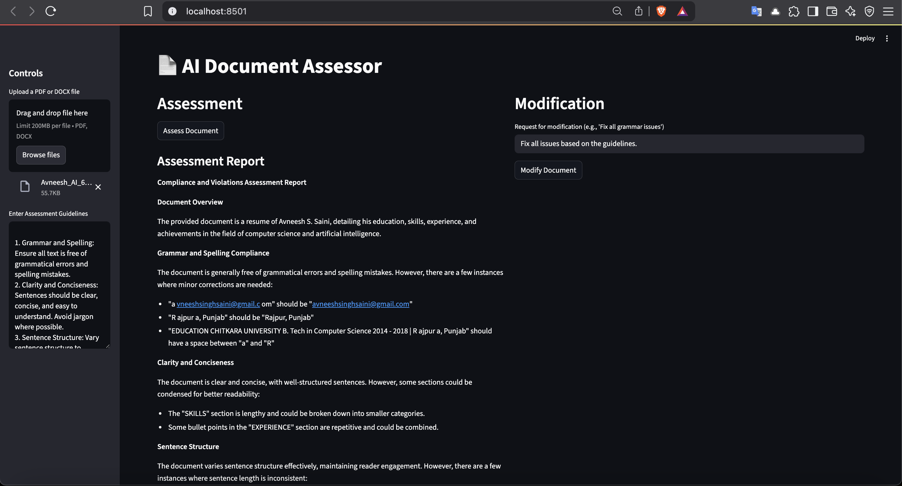
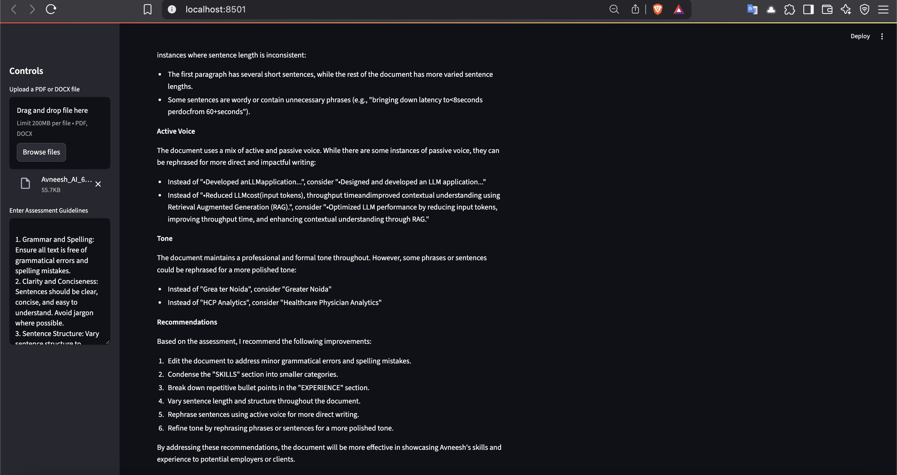

# English Guidelines Agent

This is a FastAPI application that provides an API for assessing and modifying documents based on given guidelines.
LLM used: Llama3.2:3b via Ollama (local)
Framework used: LangGraph

## Screenshots





## Setup

1. Clone the repository:
```bash
$ git clone https://github.com/avneeshafc/English-Guidelines-Agent.git
$ cd English-Guidelines-Agent
```

2. Install dependencies:
```bash
$ pip install -r requirements.txt
```

3. Run the application:
```bash
$ python src/main.py
$ streamlit run src/main.py
```

## API Endpoints


1. Assess Document
```bash
POST /assess/
```

2. Modify Document
```bash
POST /modify/
```

## Parameters

1. file: The document to be assessed or modified (PDF or DOCX format).
2. guidelines: The guidelines to be used for assessment or modification.
3. request: The modification request (optional).

## Response

1. assessment_report: The assessment report for the document.
2. modified_document: The modified document (optional).
3. error: Error message (optional).